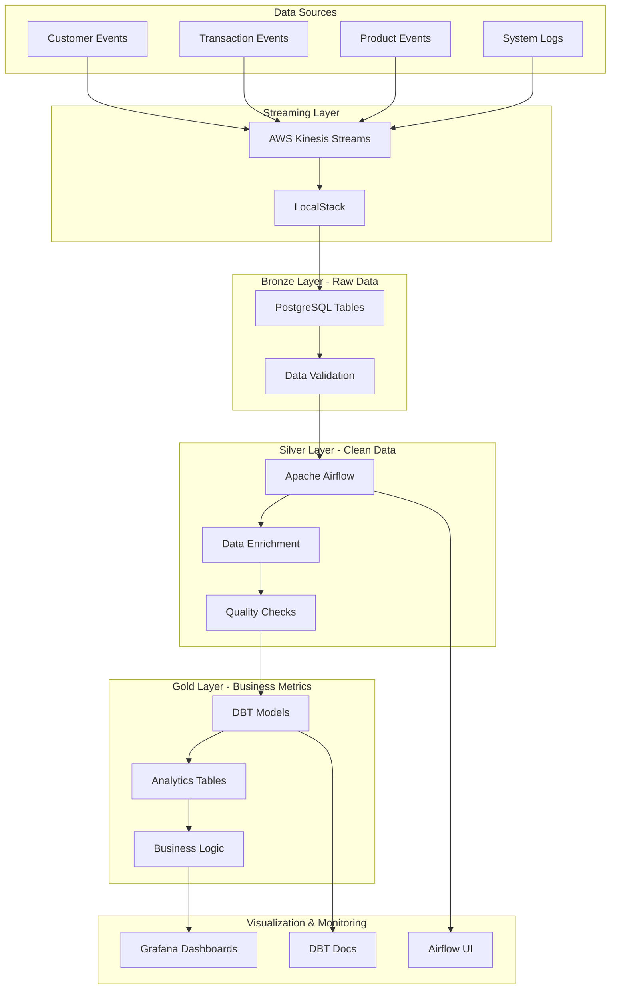

# Enterprise Data Pipeline

[](https://python.org)
[](https://airflow.apache.org)
[](https://getdbt.com)
[](https://aws.amazon.com/kinesis)
[](https://docker.com)
[](https://postgresql.org)
[](https://opensource.org/licenses/MIT)

Pipeline de dados enterprise-grade usando **AWS Kinesis + Apache Airflow + DBT** para processamento em tempo real e analytics avançadas.

## Arquitetura do Sistema



### Camadas de Dados

| Camada | Descrição | Tecnologia | Responsabilidade |
|--------|-----------|------------|------------------|
| **Bronze (Raw)** | Dados brutos ingeridos | Kinesis → PostgreSQL | Ingestão e armazenamento |
| **Silver (Clean)** | Dados limpos e enriquecidos | Apache Airflow | Transformação e qualidade |
| **Gold (Business)** | Métricas e analytics | DBT | Business intelligence |

## Características Enterprise

| Funcionalidade | Implementação | Benefício |
|----------------|---------------|----------|
| **Real-time Ingestion** | AWS Kinesis Streams | Processamento de dados em tempo real |
| **Orquestração Robusta** | Apache Airflow | Retry automático, monitoring e alertas |
| **Data Quality** | Validações automáticas | Garantia de integridade dos dados |
| **Analytics Engineering** | DBT | Transformações SQL complexas e documentadas |
| **Observabilidade** | Grafana + métricas | Monitoramento completo do pipeline |
| **Escalabilidade** | Docker + Kubernetes ready | Arquitetura distribuída |

## Stack Tecnológica

| Categoria | Tecnologia | Versão | Função |
|-----------|------------|--------|--------|
| **Streaming** | AWS Kinesis | Latest | Ingestão de dados em tempo real |
| | LocalStack | 2.3+ | Simulação AWS local |
| | Python | 3.9+ | Produtores de dados |
| **Orquestração** | Apache Airflow | 2.7+ | Workflow orchestration |
| | PostgreSQL | 15+ | Data warehouse e metastore |
| | Redis | 7+ | Celery backend |
| **Transformação** | DBT | 1.6+ | Analytics engineering |
| | SQL | ANSI | Transformações complexas |
| | Jinja2 | 3.1+ | Templates dinâmicos |
| **Monitoramento** | Grafana | 10+ | Dashboards e visualizações |
| | Prometheus | 2.40+ | Métricas e alertas |
| **Containerização** | Docker | 24+ | Containerização de serviços |
| | Docker Compose | 2.20+ | Orquestração local |

## Dados Simulados

### Streams Kinesis

| Stream | Descrição | Volume/min | Campos Principais |
|--------|-------------|------------|-------------------|
| **customer-events** | Cadastros, logins, atualizações | ~100 eventos | customer_id, event_type, timestamp |
| **transaction-events** | Transações financeiras | ~500 eventos | transaction_id, amount, payment_method |
| **product-events** | Interações com produtos | ~300 eventos | product_id, action, user_id |
| **system-logs** | Logs de aplicações | ~200 eventos | level, service, message |

### Métricas Calculadas

| Métrica | Descrição | Atualização | Uso |
|---------|-------------|--------------|-----|
| **Customer Lifetime Value (LTV)** | Valor total do cliente | Diária | Segmentação e marketing |
| **Risk Scoring** | Pontuação de risco com ML | Tempo real | Prevenção de fraudes |
| **RFM Analysis** | Recency, Frequency, Monetary | Semanal | Campanhas direcionadas |
| **Cohort Analysis** | Análise de coortes | Mensal | Retenção de clientes |
| **Revenue Attribution** | Atribuição de receita | Diária | ROI de canais |

## Métricas do Projeto


## Como Executar

### 1. Preparar Ambiente
```bash
# Criar diretórios necessários
mkdir -p airflow/{dags,logs,plugins}
echo -e "AIRFLOW_UID=$(id -u)" > .env

# Subir infraestrutura
docker-compose up -d

# Aguardar inicialização (3-5 minutos)
docker-compose logs -f airflow-init
```

### 2. Configurar Conexões Airflow
```bash
# Acessar Airflow UI: http://localhost:8080 (airflow/airflow)
# Configurar conexão PostgreSQL:
# - Conn Id: postgres_default
# - Host: postgres
# - Schema: airflow
# - Login: airflow
# - Password: airflow
```

### 3. Iniciar Pipeline
```bash
# Terminal 1: Gerar dados Kinesis
cd kinesis
pip install boto3 faker
python data_producer.py

# Terminal 2: Ativar DAG no Airflow UI
# Ou via CLI:
docker exec airflow-scheduler airflow dags unpause enterprise_data_pipeline
```

### 4. Executar DBT
```bash
# Dentro do container Airflow
docker exec -it airflow-scheduler bash
cd /opt/airflow/dbt

# Instalar dependências e executar
dbt deps
dbt run
dbt test
dbt docs generate
```

## 📈 Modelos de Dados

### Bronze Layer
- `bronze_customer_events`: Eventos brutos de clientes
- `bronze_transaction_events`: Transações brutas
- `bronze_product_events`: Interações com produtos
- `bronze_system_logs`: Logs de sistema

### Silver Layer
- `silver_customers`: Clientes consolidados e enriquecidos
- `silver_transactions`: Transações limpas com categorização
- `silver_products`: Catálogo de produtos normalizado
- `silver_sessions`: Sessões de usuário agregadas

### Gold Layer
- `gold_customer_analytics`: Analytics 360° de clientes
- `gold_business_metrics`: KPIs e métricas de negócio
- `gold_cohort_analysis`: Análise de coortes
- `gold_revenue_attribution`: Atribuição de receita

## 🔍 Qualidade de Dados

### Validações Automáticas
- **Completude**: Campos obrigatórios preenchidos
- **Unicidade**: Chaves primárias únicas
- **Consistência**: Relacionamentos válidos
- **Freshness**: Dados atualizados nas últimas 2 horas
- **Volume**: Variação de volume dentro do esperado

### Testes DBT
```sql
-- Exemplo de teste customizado
SELECT COUNT(*) as failed_records
FROM {{ ref('silver_customers') }}
WHERE email NOT LIKE '%@%'
  OR total_spent < 0
  OR created_at > CURRENT_TIMESTAMP
```

## Dashboards e Métricas

### KPIs Principais

| KPI | Descrição | Meta | Frequência |
|-----|-------------|------|-------------|
| **Revenue Growth** | Crescimento de receita MoM/YoY | >15% | Mensal |
| **Customer Acquisition Cost (CAC)** | Custo de aquisição | <R$ 50 | Semanal |
| **Monthly Recurring Revenue (MRR)** | Receita recorrente mensal | Crescimento 10% | Mensal |
| **Churn Rate** | Taxa de cancelamento por segmento | <5% | Mensal |
| **Average Order Value (AOV)** | Valor médio do pedido | >R$ 150 | Diário |

### Dashboards Grafana

| Dashboard | Objetivo | Usuários | Atualização |
|-----------|----------|----------|-------------|
| **Executive Dashboard** | KPIs executivos | C-Level | Tempo real |
| **Operations Dashboard** | Métricas operacionais | Ops Team | 5 min |
| **Data Quality Dashboard** | Saúde dos dados | Data Team | 1 min |
| **Pipeline Monitoring** | Status dos jobs | DevOps | Tempo real |

## 🔧 Configurações Avançadas

### Airflow
```python
# airflow.cfg customizations
[core]
executor = LocalExecutor
max_active_runs_per_dag = 1
dagbag_import_timeout = 30

[scheduler]
catchup_by_default = False
max_threads = 4
```

### DBT
```yaml
# dbt_project.yml
models:
  enterprise_dw:
    bronze:
      +materialized: table
      +pre-hook: "{{ log('Processing bronze layer', info=True) }}"
    silver:
      +materialized: table
      +post-hook: "{{ run_query('ANALYZE ' ~ this) }}"
    gold:
      +materialized: table
      +indexes:
        - columns: ['customer_id']
          unique: true
```

## 🧪 Testes e Validação

### Testes Unitários
```bash
# Testar modelos DBT
dbt test --models silver_customers
dbt test --models gold_customer_analytics

# Testar DAGs Airflow
python -m pytest tests/test_dags.py
```

### Testes de Integração
```bash
# Validar pipeline end-to-end
./scripts/integration_test.sh
```

## 🚀 Deploy e CI/CD

### Ambientes
- **DEV**: Desenvolvimento local com LocalStack
- **STAGING**: Ambiente de homologação
- **PROD**: Produção com AWS real

### Pipeline CI/CD
```yaml
# .github/workflows/deploy.yml
- name: Test DBT Models
  run: dbt test --profiles-dir ./profiles

- name: Deploy to Staging
  run: dbt run --target staging

- name: Run Data Quality Checks
  run: python scripts/data_quality_check.py
```

## 📚 Tecnologias Demonstradas

### Data Engineering
- **Stream Processing**: Kinesis real-time ingestion
- **Batch Processing**: Airflow orchestration
- **Data Modeling**: DBT dimensional modeling
- **Data Quality**: Automated testing and validation

### DevOps & MLOps
- **Containerization**: Docker multi-service setup
- **Infrastructure as Code**: Docker Compose
- **Monitoring**: Grafana + custom metrics
- **Documentation**: Auto-generated DBT docs

### Analytics Engineering
- **Dimensional Modeling**: Star schema implementation
- **Business Logic**: Complex SQL transformations
- **Performance Optimization**: Indexes and partitioning
- **Data Lineage**: DBT automatic lineage tracking

## Próximos Passos

### Roadmap Técnico

| Prioridade | Feature | Estimativa | Status |
|------------|---------|------------|--------|
| **Alta** | Apache Iceberg para data lakehouse | 2 semanas | Planejado |
| **Alta** | Great Expectations para data quality | 1 semana | Planejado |
| **Média** | Apache Superset para self-service BI | 3 semanas | Backlog |
| **Média** | CDC (Change Data Capture) | 2 semanas | Backlog |
| **Baixa** | Machine learning features | 4 semanas | Pesquisa |
| **Baixa** | Alertas inteligentes | 1 semana | Backlog |

## Contribuição

### Como Contribuir

1. **Fork** o repositório
2. **Clone** sua fork localmente
3. **Crie** uma branch para sua feature (`git checkout -b feature/nova-funcionalidade`)
4. **Commit** suas mudanças (`git commit -m 'feat: adicionar nova funcionalidade'`)
5. **Push** para a branch (`git push origin feature/nova-funcionalidade`)
6. **Abra** um Pull Request

### Padrões de Commit

- `feat:` Nova funcionalidade
- `fix:` Correção de bug
- `docs:` Atualização de documentação
- `style:` Formatação de código
- `refactor:` Refatoração de código
- `test:` Adição de testes

### Diretrizes de Código

- Seguir PEP 8 para Python
- Documentar funções com docstrings
- Escrever testes para novas funcionalidades
- Manter cobertura de testes acima de 80%

## Licença

Este projeto está licenciado sob a Licença MIT - veja o arquivo [LICENSE](LICENSE) para detalhes.

## Contato

**Desenvolvido por Ivan de França**

- **LinkedIn**: [Ivan de França](https://linkedin.com/in/ivan-franca)
- **Email**: ivan.franca@email.com
- **GitHub**: [@ivan-franca](https://github.com/ivan-franca)

---

*Pipeline enterprise demonstrando as melhores práticas em Data Engineering, Analytics Engineering e DataOps.*

**Tags**: `data-engineering` `apache-airflow` `dbt` `aws-kinesis` `postgresql` `docker` `grafana` `analytics-engineering` `dataops` `real-time-processing`